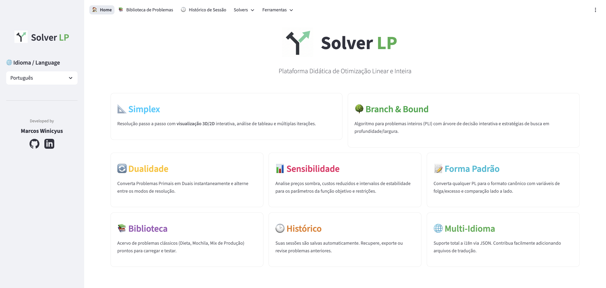

# Visual Optimization System 📊

<div align="center">
  
  <br><br>

  [](https://solver-linear-programing.streamlit.app/)
  
  **[🚀 Try it live on Streamlit Cloud! | Teste a versão online agora na Streamlit Cloud!](https://solver-linear-programing.streamlit.app/)**
</div>

## About the Project

The **Visual Optimization System** (Solver LP) is an interactive and didactic platform developed to assist in teaching and learning Operations Research. It focuses on the resolution and visualization of **Linear Programming (LP)** and **Integer Programming (IP)** problems.

Built with **Python** and **Streamlit**, the system offers rich visualizations (2D/3D charts, decision trees, step-by-step tableaux) to turn abstract mathematical concepts into tangible experiences.

---

## 🚀 Key Features

### 📐 Simplex
- **Step-by-Step Resolution:** Follow each iteration of the Simplex algorithm.
- **3D/2D Visualization:** Interactive charts of the feasible region identifying vertices and the solution path.
- **Interactive Tableau:** Detailed display of basic and non-basic variables and pivoting operations.
- **Case Identification:** Detects optimal solutions, multiple solutions, unbounded problems, and infeasible cases.

### 🌐 Internationalization (Multi-Language)
The project supports multiple languages via JSON files.
- **Supported Languages:** Portuguese (pt), English (en), Spanish (es).
- **Contribution:** To add a new language, simply create a `.json` file in `ui/locales/` (e.g., `fr.json`) mirroring the structure of `en.json` and submit a Pull Request. The system will automatically detect it.

### 🌳 Branch & Bound
- **Integer Programming:** Complete algorithm for solving IP problems.
- **Visual Decision Tree:** Real-time interactive graph showing nodes, prunings (bound, integrality, infeasibility), and branches.
- **Search Strategies:** Support for BFS, DFS, and Best-Bound.

### 🛠️ Analysis Tools
- **🔄 Primal-Dual Converter:** Instantly transform problems and solve the Dual.
- **📊 Sensitivity Analysis:** Calculate Shadow Prices and stability intervals for objective function coefficients ($c_j$) and constraints ($b_i$).
- **📝 Standard Form:** Automatic converter to canonical form (Maximization, Equalities, RHS $\ge$ 0) with didactic step-by-step explanation.

### 📚 Additional Resources
- **Problem Library:** Collection of classic problems (Diet, Knapsack, Production Mix) ready for testing.
- **Session History:** Your solved problems are automatically saved for comparison and review.

### 📖 Detailed Documentation
- [Features Documentation](docs/FEATURES.md) - Detailed breakdown of functional and non-functional requirements.
- [Architecture Documentation](docs/ARCHITECTURE.md) - Technical decisions, structure, and diagrams (C4 Model).

---

## 🛠️ Technologies

- **Frontend:** [Streamlit](https://streamlit.io/)
- **Numerical Calculation:** [NumPy](https://numpy.org/) and [Pandas](https://pandas.pydata.org/)
- **Visualization:** [Plotly](https://plotly.com/) (Charts) and [St-Link-Analysis](https://github.com/AlrasheedA/st-link-analysis) (Graphs/Trees)

---

## ⚡ How to Run

### Prerequisites
- Python 3.8+

### Step-by-Step

1. **Clone the repository**
   ```bash
   git clone <repository-url>
   cd solver_pl
   ```

2. **Create a virtual environment**
   ```bash
   # MacOS/Linux
   python3 -m venv .venv
   source .venv/bin/activate
   
   # Windows
   python -m venv .venv
   .venv\Scripts\activate
   ```

3. **Install dependencies**
   ```bash
   pip install -r requirements.txt
   ```

4. **Run the application**
   ```bash
   streamlit run app.py
   ```

---

## 📂 Project Structure

```
solver_pl/
├── app.py                  # Main Entrypoint (Navigation)
├── core/                   # Mathematical Logic (Solvers)
│   ├── simplex_solver.py       # Primal Simplex
│   ├── branch_bound_solver.py  # Branch & Bound
├── ui/                     # User Interface (Pages)
│   ├── home_page.py            # Main Dashboard
│   ├── simplex_page.py         # Simplex UI
│   ├── branch_and_bound_page.py# Branch & Bound UI
│   ├── sensitivity_page.py     # Sensitivity Analysis
│   ├── Standard_form_page.py   # Standard Form Converter
│   ├── duality_page.py         # Dual Converter
│   ├── library_page.py         # Problem Library
│   └── plots.py                # 2D/3D Chart Generation
```

---

*Developed with ❤️ for educational purposes - v0.5 (January 2026)*
